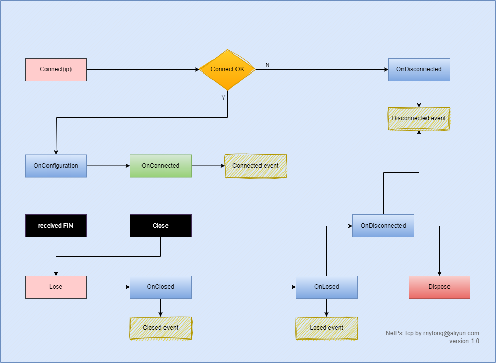
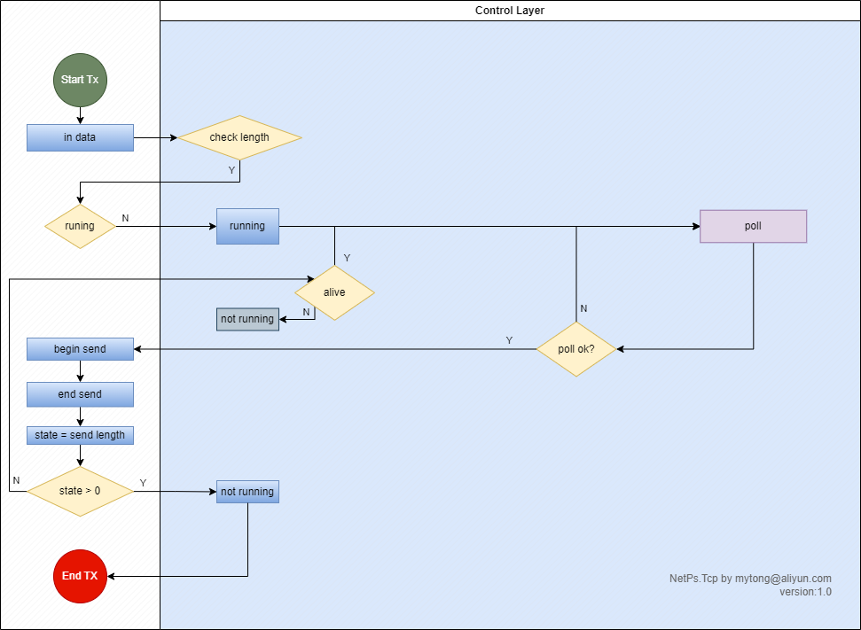
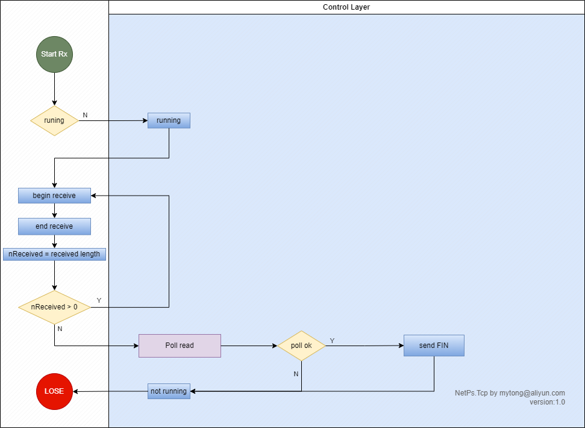
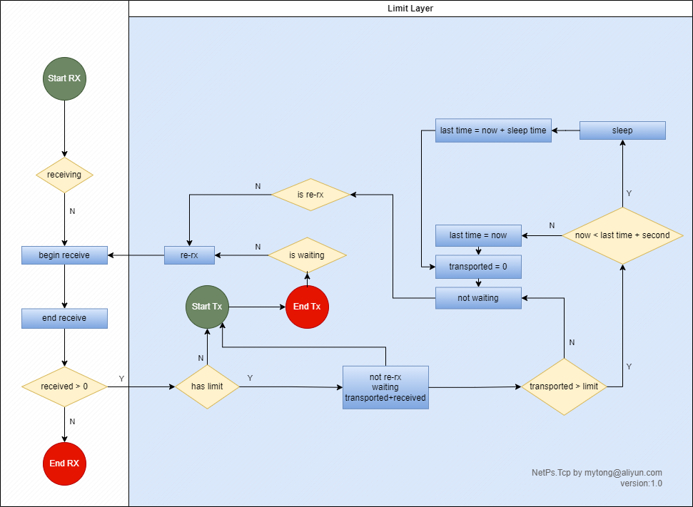
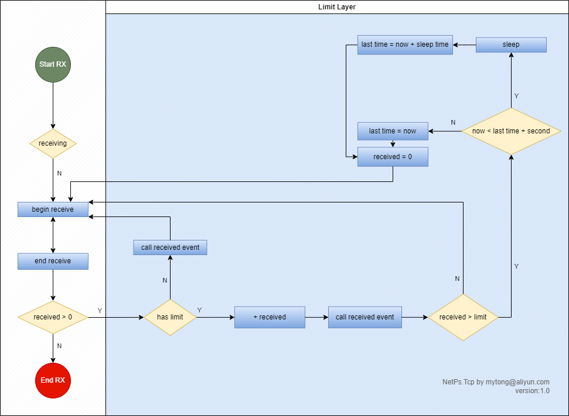
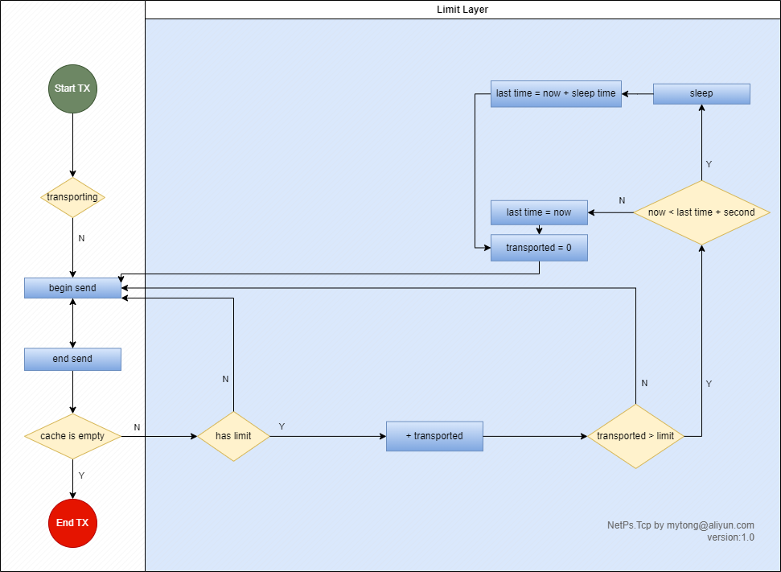

# lifetime

## 01.TcpClient



## 02.TcpServer


# base

## 01. TcpTx

- **发送队列**：添加数据，无需等待发送完成。
- **重传**：接收方不能及时接收，再次发送未完成数据。



## 02. TcpRx

- **数据接收**：每次接收数据发送通知事件。



# limit speed

## 01. TcpRxRepeater

- **转发**：将Rx接收的数据转发到任意实现 ```IDataTransport``` 接口的实例中。
- **流控制**：限制发送接收带宽，由发送完成事件驱动 再次接收。



## 02. TcpLimitRx

- **流控制**：限制接收数据带宽。



## 03. TcpLimitTx

- **流控制**：限制发送数据带宽。

